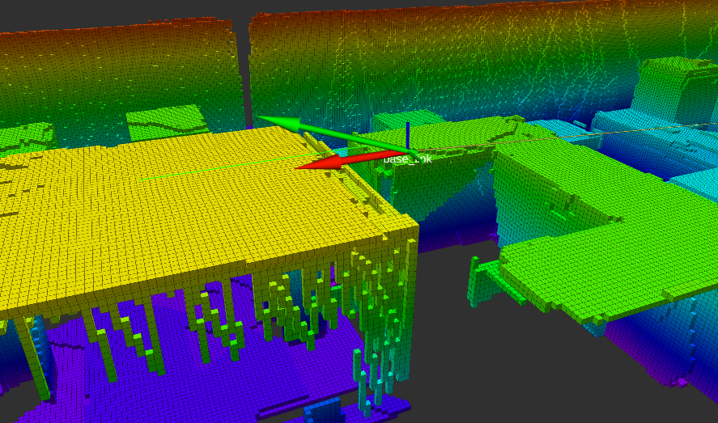

# UAV exploration in unknown environment and QR detection

## Project description
Development of an autonomous control system using ROS OS for UAV in an exploration scenario. Firstly, the UAV has to explore the worlds (building a map using *octomaps*) detecting the positions of some QR codes placed in there (*VISP* package is used as camera visual tracking). Lately, the UAV has to reach the position of these QR codes (*OMPL* is used for obastacle avoidance). 

## Setup Instructions
It is recommended to use Ubuntu 18.04, gazebo-8 and ROS melodic since all the tests have been made on it. 

## Dependencies Installation
- Download the code in the ROS src folder using 
     ```sh
    $  git clone https://github.com/AlessandroMelone/mavros_visp_ompl_exploration.git
    ```

- Download [jocacace/Firmware](https://github.com/jocacace) and follow the instruction in the related [README](https://github.com/jocacace/Firmware/blob/master/README.md). Doing this step, when the istructions 
    ```sh
    $ cd Firmware && make px4_sitl_default
    $ make px4_sitl_default gazebo
    ```
    are meet, you need to generate the sdf file used in this project before to run the above istructions. 
    
    To generate the desired UAV sdf file you need to replace two files:
    - Replace the file *model_generation.txt* cointained in the folder *Firmware/Tools/sitl_gazebo* with the file of the same name contained in the folder *mavros_visp_ompl_exploration/file_sdf_generation*.
    - Replace the file *tarot.xacro* cointained in the folder *Firmware/Tools/sitl_gazebo/models/rotors_description/urdf/tarot*
    with the file of the same name contained in the folder *mavros_visp_ompl_exploration/file_sdf_generation*. 
    - Delete the file *tarot.sdf* (which will be generated after the following instructions) cointained in *Firmware/Tools/sitl_gazebo/models/tarot* .
    
    Now you can run: 
     ```sh
    $ cd Firmware && make px4_sitl_default
    $ make px4_sitl_default gazebo
    ```

    now continue to execute the instructions in the README of *jocacace/Firmware*.
- Install the following packages:
    - OMPL:
    Download the OMPL installation script from this link: https://ompl.
    kavrakilab.org/install-ompl-ubuntu.sh:
        ```sh    
        $ chmod u+x install-ompl-ubuntu.sh
        $ ./install-ompl-ubuntu.sh wil
        $ sudo apt-get install ros-melodic-ompl
        ```
    - visp_auto_tracker:
        ```sh
        sudo apt-get install ros-melodic-visp-auto-tracker
        ```
## Building 
Now you are ready to build the code.
In your ROS src folder execute:
```sh
    $ catkin_make
```
#### Fixes
If the building fails then probably the messages needed by the code are not created when the code is compiled.
In this case you just need to comment the commands *add_executable(...)*  and *target_link_libraries(...)* in all the *CMakeLists.txt* in the *mavros_visp_ompl_exploration* folder, and repeat the command: 
```sh
    $ catkin_make
```

Now the messages files have been created so restore the *CMakeLists.txt* files and build again.
## Running 
- To run the code, first of all you have to launch the Gazebo simulation. Before running the simulation you should load the gazebo configuration as explained in *jocacace/Firmware* README. 
Run the following istructions: 
     ```sh    
        $ roscd px4
        $ cd Tools/sitl_gazebo && source load_sitl_conf.sh
    ```
    then, you can run the Gazebo simulation in the same command line window using
     ```sh    
        $ roslaunch master_pkg tarot.launch 
    ```

- And in another command line windows :
     ```sh    
        $ roslaunch master_pkg all.launch
    ```
Now a menu should appear that allows to start various task.

#### Tips
If you want to have the Px4 package outside of the src folder of your ROS workspace, you could add at your .bashrc the following: 
```sh 
export ROS_PACKAGE_PATH=$ROS_PACKAGE_PATH:/home/your_user_name/Firmware/
```
Now to check if all is ok you could execute:
```sh 
$ roscd px4
```
And now you should be in the *Firmware* folder.
## Rviz
After the command `$ roslaunch master_pkg all.launch` will start rviz with as shown by the following image.


After done the command `roslaunch master_pkg all.launch` will start rviz and will show: 
* desired pose pose of the UAV: red arrow. 
* velocity command computed by the PID: rviz marker green arrow. 
* last path sent by the action client to the action server: green line.

## Test
To watch two test with different QR codes positions click the following link: https://youtu.be/9q2p-nuvVdM

